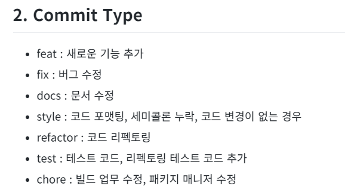
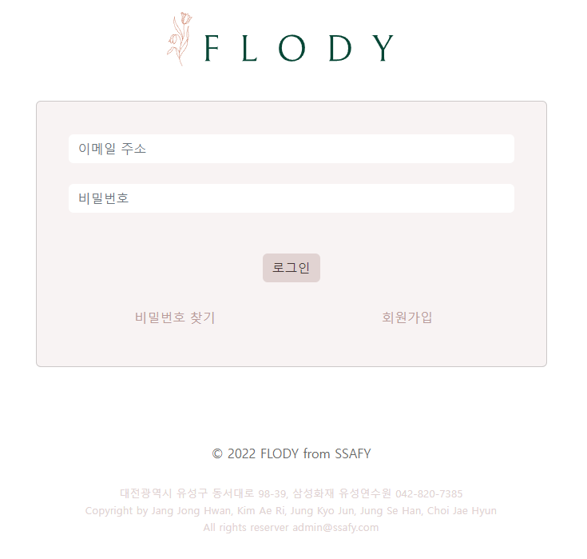

# 웹/모바일(웹 디자인) 프로젝트

<!-- 필수 항목 -->

## 카테고리

| Application                          | Domain                        | Language                         | Framework                            |
| ------------------------------------ | ----------------------------- | -------------------------------- | ------------------------------------ |
| :white_check_mark: Desktop Web       | :white_check_mark: Web Design  | :white_check_mark: JavaScript    | :white_check_mark: Vue.js             |
| :black_square_button: Mobile Web     | :black_square_button: Web RCT | :black_square_button: TypeScript | :black_square_button: React           |
| :black_square_button: Responsive Web | :black_square_button: Web IoT | :black_square_button: C/C++      | :black_square_button: Angular        |
| :black_square_button: Android App    | :black_square_button: Mobile  | :black_square_button: C#         | :black_square_button: Node.js        |
| :black_square_button: iOS App        |                               | :black_square_button: Python     | :black_square_button: Flask/Django   |
| :black_square_button: Desktop App    |                               | :white_check_mark: Java          | :white_check_mark: Spring/Springboot |

<!-- 필수 항목 -->

## 프로젝트 소개

* **프로젝트명**: 공부 기록 SNS, FLODY
* **서비스 특징**: 웹디자인 기반의 SNS 프로젝트
* **주요 기능**
  - 회원 관리
  - 뉴스피드 / 게시판
  - 자격증 정보
  - 스터디 그룹
  - 게이미피케이션(꽃)
* **주요 기술**
  - Firebase를 활용한 1:1 채팅
  - JWT Authentication
  - REST API
* **참조 리소스**
  * figma : 와이어 프레임워크


<!-- 자유 양식 -->

## 팀 소개

* **장종환**: 팀장, 백엔드 개발
* **김애리**: 팀원, 프론트엔드 개발
* **정교준**: 팀원, 프론트엔드 개발
* **정세한**: 팀원, 프론트엔드 개발
* **최재현**: 팀원, 프론트엔드 개발

<!-- 자유 양식 -->
## Commit Convention
#### Convention


#### Example
```
feat : add login service
docs : 
```


## 프로젝트 상세 설명

* 프로젝트 기획
코로나19로 인해 술자리나 회식, 사적모임 등이 제한되고 있지만, 이에 대한 특별한 방안이 없어 발생하고 있는 사회적 이슈를 해결하기 위해 '랜선 술자리 서비스 짠해' 프로젝트를 기획하게 되었습니다.
* 개발 환경 및 기술 스택
  * platform : Web
  * library : Vue3
  * framework : SpringBoot
  * database : MySQL, Firebase
  * server : AWS EC2
  * language : Java, JavaScript


**BE**
- **IDE** : IntelliJ
- **Framework** : Spring boot
- **JAVA** : 8
- **Build** : Gradle
- **WAS** : Tomcat
- **DBMS** : MySql
- **DB API** : JPA

**FE**
- **IDE** : vscode
- **Framework/Library** : Vue3

**Server**

- Docker
- NginX
- **진행 기간**: 2022.07.11 ~ 2022.08.19

## 기능 상세 설명

 1. ### 초기 화면(로그인)

    

    - 서비스 입장시 처음 보이는 화면입니다.
    - 이메일 주소와 비밀번호를 통해서 로그인을 할 수 있고 비밀번호 분실시 비밀번호를 찾을 수 있습니다.
    - 이메일 주소 칸이나 비밀번호를 비워둔 상태나 사용자가 존재하지 않는 아이디나, 비밀번호를 잘못 입력한 상태로 로그인을 진행하게 되면 사용자에게 알림 메세지를 보여줍니다.

    ### 회원가입

    -16608768068733.png)

    - 서비스를 이용하기 위해서는 반드시 회원가입이 필수입니다.
    - 이메일 주소 공간 옆 중복확인 버튼을 활용해서 아이디 중복체크를 할 수 있습니다.
    - 비밀번호는 7자리 이상으로 비밀번호 확인과 같지 않을 경우 회원가입이 불가능 합니다.
    - 회원가입 무결성 검사를 통화하면 옆에 초록색 체크가 나타나면서 회원가입 가능 여부를 판단할 수 있습니다.

    -16608768093684.png)

    ### 메인화면

    -16608768113515.png)

    - 로그인 후 메인화면으로 이동한 모습입니다.
    - 왼쪽 상단 로고 버튼으로 클릭시 홈화면으로 돌아갑니다.

    ### 개인 목표

    -16608768129846.png)

    - 왼쪽 상단 자신의 닉네임 밑의 목표 등록 버튼을 클릭하면 위의 사진처럼 모달이 등장합니다.
    - 자신이 목표한 시험 이름과 날짜를 기입해 등록버튼을 클릭합니다.

    -16608768146047.png)

    - 목표가 추가된것을 확인할 수 있다.

    ### 스터디 목록

    -16608768161898.png)

    - 현재 로그인한 계정이 가입한 스터디 목록입니다.
    - 우측 상단의 +를 클릭하면 다른 스터디에 가입할 수 있습니다.
    - 현재 스터디의 이름 옆의 아이콘을 클릭하면 해당 스터디의 페이지로 이동합니다.

    ### 스터디 검색

    -16608768176339.png)

    - 스터디를 가입하기 위해서 현재 존재하고 있는 스터디를 검색할 수 있는 페이지입니다.
    - 검색어를 통해서 스터디의 이름을 조회할 수 있고 조회된 스터디의 이름을 클릭하면 해당 스터디의 정보와 스터디원의 목록을 확인할 수 있습니다.
    - 또한 원하는 스터디가 없을 경우 하단의 스터디 만들기 버튼을 통해서 새로운 스터디를 만들 수 있습니다.

    ### 스터디 생성

    -166087681962110.png)

    - 스터디명, 스터디원 아이디를 추가해서 스터디원을 추가, 스터디 소개글을 작성해서 만들기 버튼을 클릭하면 스터디를 생성할 수 있습니다.

    -166087682110211.png)

    - 스터디가 추가된 것을 확인할 수 있습니다.

    ### 스터디 상세 페이지

    -166087682243212.png)

    - 상단에 스터디의 제목을 보여주고 있습니다.
    - 제목 바로 아래에는 현재 스터디 인원의 목록을 스터디장과 구분해서 보여주고 있습니다.
    - 스터디 인원을 클릭하면 해당 유저의 뉴스피드로 이동하게 됩니다.
    - 스터디원 목록 바로 아래에는 달력과 스터디 todo list를 보여주고 있습니다.
    - 스터디 todo list 바로 아래에는 스터디 원들의 플라워들을 이동시켜서 스터디만의 꽃밭을 관리할 수 있습니다.
    - 스터디 상세 페이지의 하단에 위치한 스터디 나가기 버튼을 클릭하면 해당 스터디를 나갈 수 있습니다.

    ### 뉴스피드

    -166087682435013.png)

    - 상단 메뉴의 뉴스피드를 클릭하면 유저들의 뉴스피드를 확인할 수 있습니다.
    - 초기의 뉴스피드의 헤더에는 자신의 정보를 출력합니다.

    ### 뉴스피드 팔로워/팔로우

    -166087682593814.png)

    - 뉴스피드 헤더 아이디 바로 아래에 위치한 팔로워 or 팔로우를 클릭하면 현재 팔로워 or 팔로우 정보를 확인할 수 있습니다.

    ### 유저의 프로필 편집

    -166087682809315.png)

    - 뉴스피드 헤더의 유저 아이디 옆의 톱니바퀴 아이콘을 클릭하면 해당 유저의 프로필 편집 페이지로 이동하게 됩니다.
    - 프로필 편집 페이지에서 사진, 이름, 닉네임, 소개, 주소, 전화번호를 수정할 수 있습니다.

    ### 유저의 비밀번호 변경

    -166087683002716.png)

    - 프로필 편집 아래에 위치한 탭을 클릭하게 되면 비밀번호 변경 페이지로 이동하게 됩니다.
    - 비밀번호 변경 페이지에서 유저의 비밀번호를 변경할 수 있습니다.

    ### 다른 유저의 뉴스피드

    -166087683197917.png)

    - 다른 유저의 아이디를 클릭했을때 뉴스피드의 헤더에 그 유저 정보를 출력합니다.
    - 뉴스피드의 헤더가 바뀐 것을 확인할 수 있습니다.

    ### 다른 유저와의 실시간 채팅

    -166087683345218.png)

    - 뉴스피드 아이디 옆의 메시지 보내기를 클릭하면 실시간으로 채팅이 가능합니다.

    ### 공부게시판

    -166087683485019.png)

    - 상단 메뉴의 공부게시판을 클릭하면 자격증 검색 페이지로 이동할 수 있습니다.
    - 초기 게시판 페이지는 카테고리 별로 5개의 게시글을 보여줍니다.

    ### 공부게시판 카테고리 페이지

    -166087683696120.png)

    - 카테고리 이름 옆의 아이콘을 클릭시 해당 카테고리의 게시글 리스트 페이지로 이동하게 됩니다.

    ### 게시글 정보

    -166087683876021.png)

    - 게시글을 클릭하면 게시글 정보 페이지로 이동하게 됩니다.

    ### 자격증 검색

    -166087684086622.png)

    - 상단 메뉴의 자격증 검색을 클릭하면 자격증 검색 페이지로 이동할 수 있습니다.
    - 자격증 검색 페이지에서 대분류, 중분류, 카테고리(자격증 이름 or 학과명), 검색어를 통해서 자격증의 정보들을 얻을 수 있습니다.

    ### 내 공부방

    -166087684935023.png)

    - 상단 메뉴의 내 공부방을 클릭하면 내 공부방 페이지로 이동할 수 있습니다.
    - 상단에는 꽃 그림이 보여지고 스터디 활동량에 따른 경험치를 통해 꽃이 성장할 수 있습니다.
    - 꽃 그림 아래에는 자신의 todo list를 달력으로 확인할 수 있습니다.
    - todo list 아래에는 그날의 꽃 상태를 스탬프 형식으로 저장할 수 있습니다.
